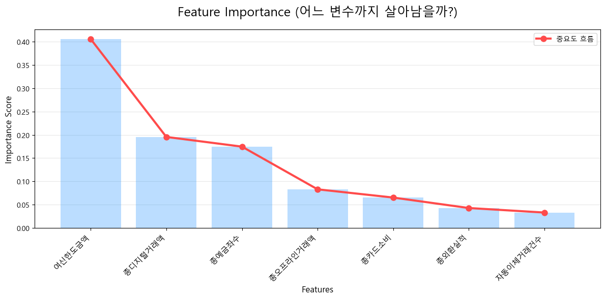
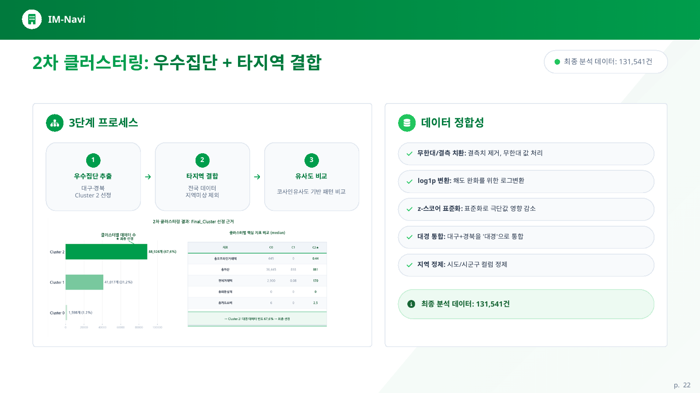
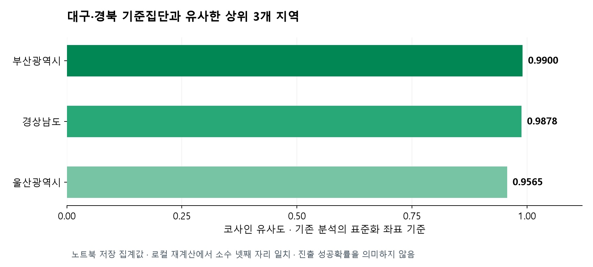
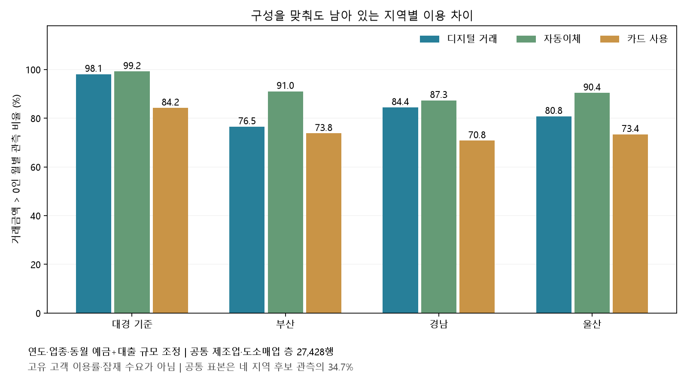

# iM-Navi · 대구·경북의 거래 강점을 다른 지역에서도 활용할 수 있을까?

**대구·경북의 특징적인 기업 거래 패턴을 찾아 부산·경남·울산과 비교하고, 지역별로 먼저 시험할 캠페인을 제안한 데이터 분석 프로젝트입니다.**

**발표자료:** [발표자료 PDF](docs/presentation-public.pdf) · [수록 범위와 당시 표현의 정정 안내](docs/presentation-notes.md)

유사한 지역을 찾는 데서 한 걸음 더 나아가, **“어떤 거래가 다르고, 그 차이를 적은 비용으로 확인하려면 무엇부터 해야 하는가?”**를 분석했습니다.

| 항목 | 내용 |
|---|---|
| 팀 프로젝트 | iM-Navi · 5인 · 2026.04.13–04.23 |
| 데이터 | 교육용 법인 거래 데이터, 2022.01–2024.12 · 347,299개 월별 관측 |
| 당시 분석 | Random Forest → K-Means → 지역별 코사인 유사도 |
| 추가 분석 | 상위 3개 지역의 거래 특성 비교 → 고객 구성 조정 → 캠페인·손익 조건 제안 |
| 개인 역할 | 프로젝트 개요·분석 방향 설정, 데이터 전처리, 예대마진 회귀 모델링 및 주요 변수 선정, 2단계 K-Means 군집화, 코사인 유사도·유클리드 거리 기반 패턴 매칭 및 비교 |

### 먼저 읽는 결론

- **어디를 살펴볼까?** 기존 분석에서는 부산·경남·울산이 대경 기준집단과 유사했습니다.
- **무엇이 다를까?** 추가 분석에서는 고객 구성을 맞춘 비교에서도 세 지역의 디지털·자동이체 이용 관측 비율이 대경보다 낮았습니다.
- **무엇부터 해볼까?** 부산은 디지털 이용 지원, 경남은 자동이체·결제 상담, 울산은 소규모 수요 확인을 먼저 제안합니다. 실제 수요와 접촉 가능성을 확인한 뒤 시험할 가설입니다.
- **얼마나 이득일까?** 아직 실측하지 않았습니다. 같은 예산의 영업 방식들을 비교하고, 추가 전환이 어느 수준이어야 비용을 회수하는지 계산했습니다.

> 본문에서 **관측 수는 고객 수가 아닙니다.** 법인 ID가 없어 같은 고객의 월별 자료를 연결하거나 중복을 제거할 수 없습니다. 캠페인 수요·효과·수익도 별도로 검증해야하는 한계가 존재합니다.

[문제와 데이터](#1-왜-이-분석을-했는가) · [분석 방법](#2-대경의-거래-특징을-어떻게-찾았는가) · [지역별 발견](#3-비슷한-세-지역은-무엇이-달랐는가) · [캠페인](#4-지역별로-무엇부터-시험할까) · [손익](#5-같은-예산이라면-어떤-방식부터-시험할까) · [실행 안내](#7-코드와-결과-확인)

## 1. 왜 이 분석을 했는가?

새로운 지역에 지점과 인력을 투입하려면 비용이 듭니다. 그래서 먼저 **기존 강점 지역에서 관찰한 거래 관계와 비슷한 모습이 다른 지역에도 있는지** 확인하고, 추가 시장조사의 출발점을 정하고자 했습니다.

여기서 ‘대경의 DNA’는 지역의 고유 성질이 아니라, 데이터에서 관찰한 **여신 규모·예금 관계·디지털 이용·추정 이자 기여 등의 거래 특성**을 뜻합니다. 다른 지역에 그대로 복제할 수 있다고 가정하지 않았습니다.

분석에는 은행이 제공한 교육용 월별 법인 거래 45개 변수와 월별 평균 금리를 사용했습니다. 잔액·거래금액·상품 및 채널 이용·업종·지역을 확인할 수 있지만, 지역 전체 기업이나 잠재 신규 고객을 대표하는 데이터는 아닙니다. 금액 단위는 백만원이며, 구간형 건수는 대표값으로 바꿨습니다.

**이 단계의 판단:** 이 데이터로 할 수 있는 일은 ‘투자하면 성공할 지역’을 확정하는 것이 아니라, **추가로 조사할 지역과 거래 관계를 좁히는 것**입니다.

## 2. 대경의 거래 특징을 어떻게 찾았는가?

전체 분석은 아래 질문을 차례로 해결하도록 설계했습니다.

| 단계 | 답하려던 질문 | 다음 단계로 넘긴 결과 |
|---|---|---|
| 회귀분석 | 어떤 거래 변수가 추정 예대마진과 관련되는가? | 중요 거래 변수 선정 |
| 1차 군집화 | 대경 안에서 어떤 집단을 기준 패턴으로 삼을까? | 대경 기준집단 추출 |
| 2차 군집화 | 타지역 관측 중 기준집단과 함께 묶이는 집단은 무엇인가? | 타지역의 추가 영업 검토 후보군 구성 |
| 유사도 비교 | 후보군 안에서 어느 지역의 거래 패턴이 대경과 닮았는가? | 부산·경남·울산 선정 |
| 사후 지역 분석 | 각 지역에 어떤 거래 차이가 있고 무엇부터 시험할까? | 지역별 캠페인 가설과 손익 조건 |

### ① 회귀분석: 예대마진과 관련된 변수를 골랐습니다

**왜?** 여러 거래 변수 중 무엇을 중심으로 고객을 비교할지 근거가 필요했습니다.

**방법:** 대출·예금 잔액에 평균 금리를 적용한 ‘추정 예대마진’을 만들고, Random Forest 회귀로 관련 거래 변수를 살폈습니다. Random Forest는 여러 결정나무의 예측을 결합해 비선형 관계를 학습하는 방법입니다. 타깃 산식에 직접 들어가는 잔액·이자 금액은 입력에서 제외했습니다.

회귀의 목표값 **y는 추정 예대마진**, 입력 X는 거래·채널·상품 관계를 설명하는 변수였습니다. 회귀분석 자체가 최종 목적이라기보다, 이후 군집화에서 **수익 기여와 관련된 거래 특징을 중심으로 비교하기 위한 변수 선정 단계**였습니다.



**결과:** 여신한도·디지털 거래·예금좌수의 모델 중요도 합은 **77.56%**였습니다. 기본 모델의 저장 R²는 **0.7357**입니다. 이는 중요 변수 선정의 보조 근거이며, 수익의 77.56%를 이 변수들이 만들었다는 뜻은 아닙니다. 추정 마진도 실제 순이익과 다릅니다.

### ② 1차 군집화: 대경의 기준 패턴을 정의했습니다

**왜?** 대경 전체 평균은 거래 성격이 다른 고객들을 섞어버릴 수 있습니다.

**방법:** 위 세 변수에 추정 예대마진을 더해 K-Means로 비슷한 관측을 묶었습니다. 큰 금액의 영향을 줄이기 위해 로그 변환·표준화를 적용했습니다. K=4는 집단별 설명 가능성을 고려한 선택이며, 실루엣 점수가 가장 높았던 선택은 아닙니다.

**결과:** 4개 집단 중 예대마진·여신한도 중앙값이 가장 높은 **70,825개 관측의 집단**을 기준으로 삼았습니다. 모든 거래 지표가 가장 높거나 신용위험이 가장 낮다는 뜻의 ‘우수 고객’은 아닙니다.

| 1차 군집 | 월별 관측 수 | 추정 예대마진 중앙값 | 여신한도 중앙값 | 디지털 거래액 중앙값 | 예금좌수 중앙값 |
|---|---:|---:|---:|---:|---:|
| Cluster 0 | 47,357 | 0.8100 | 100 | 181.7 | 8 |
| Cluster 1 | 68,332 | 1.1217 | 0 | 87.6 | 2 |
| **Cluster 2 · 기준** | **70,825** | **2.6184** | **290** | **157.0** | **4** |
| Cluster 3 | 82,825 | 0.4643 | 0 | 0.0 | 2 |

*금액 단위는 백만원, 좌수는 구간 대표값입니다. 추정 예대마진의 금리 기간 환산은 확인이 필요합니다.*

**1차의 역할:** 대경 전체를 하나의 평균으로 비교하지 않고, **어떤 거래 패턴을 타지역에서 찾아볼지 기준을 정했습니다.**

### ③ 2차 군집화: 타지역의 영업 검토 후보군을 구성했습니다

**왜 한 번 더 군집화했나?** 1차는 대경 내부에서 기준을 정하는 과정입니다. 그다음에는 타지역의 서로 다른 거래 관측 중 기준집단과 함께 묶이는 대상을 좁힐 필요가 있었습니다.

**방법:** 1차에서 선택한 대경 70,825행과 정제한 타지역 60,716행을 합친 **131,541행**에 K=3 군집화를 새로 적용했습니다. 1차 모델에 타지역을 단순 대입한 것이 아니라, **기준집단과 타지역을 결합해 재군집화**한 것입니다.



*원 발표자료의 설계 흐름입니다. 그림의 67.6%는 전체 결합 관측 중 선택 군집의 비중이며 대경 고객 비중이 아닙니다. z-score는 척도를 맞추지만 이상치를 제거하는 처리는 아닙니다.*

**결과:** 대경 기준 관측이 집중된 Cluster 2의 **88,926행**을 지역 비교군으로 선택했습니다. 이 중 대경은 68,740행, 타지역은 20,186행입니다.

**2차의 역할:** 대경 패턴을 참조해 타지역의 **잠재 영업 검토 후보군(pool)**을 구성했습니다. 여기서 후보군은 은행 데이터 안의 거래 관측 집합이며, 확보된 신규 고객 명단이나 고유 법인 수를 뜻하지 않습니다.

### ④ 유사도 비교: 후보군 안에서 닮은 지역을 찾았습니다

**왜?** 기준집단과 거래 구성이 비슷한 지역을 시장조사 후보로 정하고 싶었습니다.

**방법:** 2차에서 선정한 비교군 안에서 지역별 9개 거래 변수의 표준화 중앙값을 코사인 유사도로 비교했습니다. 코사인 유사도는 거래 규모의 동일성이 아니라 **변환된 여러 지표가 가리키는 방향**이 얼마나 비슷한지 측정합니다.

유클리드 거리와 DTW도 검토했지만, 프로젝트 방향과 맞지 않아 최종 방식에서 제외했습니다. 유클리드 거리는 변환된 좌표 간 거리를, 코사인은 벡터의 방향을 비교합니다. **거래 규모 자체보다 패턴의 방향을 비교하려는 목적**에 따라 최종 지역 순위는 코사인으로 제시했습니다. 이는 코사인이 일반적으로 더 우수하다는 결론은 아닙니다.



| 기존 분석의 상위 지역 | 유사도 | 비교군의 월별 관측 수 |
|---|---:|---:|
| 부산 | 0.9900 | 5,828 |
| 경남 | 0.9878 | 3,301 |
| 울산 | 0.9565 | 1,190 |

**여기까지의 결론:** 회귀로 비교 변수를 정하고, 1차 군집으로 대경 기준을 만든 뒤, 2차 군집으로 타지역 후보군을 좁혔습니다. 마지막으로 그 후보군의 지역 패턴을 비교해 **부산·경남·울산을 추가 조사 대상으로 선정**했습니다. **유사도 0.99는 성공확률 99%가 아닙니다.** 원 분석의 대경·타지역 표준화 기준이 서로 달랐다는 한계도 있어, 확정적인 진출 순위로 사용하지 않았습니다.

[기존 분석 상세: 산식·모델 비교·군집 프로파일·노트북 그림](docs/original-analysis-details.md)

## 3. 비슷한 세 지역은 무엇이 달랐는가?

### 먼저, 지역별 고객 구성이 달랐습니다

**왜 추가했나?** 유사도만으로는 어떤 영업 활동이 필요한지 알 수 없습니다. 원래 비교군을 재현한 뒤 지역별 업종과 상품·채널 이용을 살펴봤습니다.

| 지역 | 기존 비교군에서 관찰한 특징 | 다음 확인 질문 |
|---|---|---|
| 부산 | 제조업 39.0%, 도소매업 30.3% | 기존 거래를 디지털 채널과 더 연결할 수 있을까? |
| 경남 | 제조업 63.6% | 대출 관계에 일상적인 결제·자동이체 거래를 더 연결할 수 있을까? |
| 울산 | 제조업 45.5%, 건설업 16.1% · 비교군 1,190행 | 작은 표본에서도 보이는 이용 차이가 실제 수요인가? |
| 대경 기준 | 제조업 42.6%, 도소매업 25.0% | 다른 지역 비교의 출발점 |

비중은 **선택된 은행 거래 관측의 구성**이며 지역 전체 산업 비중이 아닙니다.

### 고객 구성을 맞춘 뒤에도 이용 차이가 남는지 확인했습니다

**왜?** 제조업이 많은 지역과 도소매업이 많은 지역의 차이를 그대로 ‘지역의 차이’로 해석하지 않기 위해서입니다.

**방법:** 연도·업종·예금+대출 규모 구간이 같은 관측끼리 묶고, 네 지역에 같은 구성 비중을 적용했습니다. 이를 **직접 표준화**라고 합니다. 예를 들어 ‘제조업·중간 규모·2023년’ 관측의 비중을 지역마다 동일하게 맞추는 방식입니다.

**중요한 범위:** 네 지역 모두 충분한 자료가 있는 **제조업·도소매업의 12개 세부 집단, 27,428행**만 비교할 수 있었습니다. 아래 결과는 건설업 등 모든 업종의 결론이 아닙니다.

| 구성 조정 후 이용 관측 비율 | 대경 | 부산 | 경남 | 울산 |
|---|---:|---:|---:|---:|
| 디지털 거래 | 98.1% | 76.5% | 84.4% | 80.8% |
| 자동이체 | 99.2% | 91.0% | 87.3% | 90.4% |
| 카드 사용 | 84.2% | 73.8% | 70.8% | 73.4% |
| 외환 실적 | 11.2% | 14.4% | 9.4% | 13.2% |

*‘이용’은 해당 월 거래금액이 0보다 큰 관측입니다. 상품 보유율·고유 고객 이용률·잠재 수요가 아닙니다.*



**그래서 무엇을 발견했나?** 세 지역 모두 디지털·자동이체·카드 이용 관측 비율이 대경보다 낮았습니다. 부산은 디지털에서 **21.6%p**, 경남은 자동이체에서 **11.9%p** 차이가 있어 각각 먼저 확인할 질문으로 삼았습니다. ‘그 차이만큼 전환시킬 수 있다’는 뜻은 아닙니다.

반대로 외환은 부산·울산이 조정 후 대경보다 높았습니다. 따라서 **모든 지역에 같은 외환 확대 캠페인을 제안할 근거는 부족**합니다. 또한 이용 관측 비율이 낮아도 평균 거래금액은 높을 수 있어, 지역 전체를 ‘거래가 약하다’고 단정하지 않았습니다.

<details>
<summary>비교 범위와 연도별 확인 결과</summary>

네 지역 후보 79,059행 중 27,428행(34.7%)을 사용했습니다. 대경 23,363행, 부산 1,937행, 경남 1,543행, 울산 585행입니다. 네 지역 각각 30행 이상 있는 연도×업종×규모 구간만 남겼습니다. 포함되지 않은 관측으로 일반화하지 않습니다.

규모는 같은 월의 예금+대출 합이며 전체 비교군의 4분위로 나눴습니다. 기업 총자산이나 과거 규모가 아닙니다. 층 안의 차이와 측정되지 않은 요인이 남고, 원 군집 선택의 영향도 유지됩니다.

원 비교군의 연도별 집계에서도 2022·2023·2024년 모두 세 지역의 디지털·자동이체·카드 이용 관측 비율이 대경보다 낮았습니다. 이는 보조적인 기술통계이며 미래 성과 검증은 아닙니다. 법인 ID가 없어 월별 관측을 독립 고객으로 가정한 p-value·신뢰구간은 제시하지 않았습니다.

[계산 방법·해석 범위](docs/regional-campaign-method.md) · [전체 집계 결과](assets/regional-campaign-results.json)

</details>

## 4. 지역별로 무엇부터 시험할까?

**목적은 대경의 상품을 그대로 복제하는 것이 아니라, 지역별로 확인할 거래 관계를 골라 작은 실험을 하는 것입니다.** 아래는 실행 실적이 아닌 후속 제안입니다.

| 지역 | 분석에서 출발한 제안 | 먼저 확인할 조건 | 파일럿에서 볼 결과 |
|---|---|---|---|
| **부산** | 기존 거래 법인 대상 기업뱅킹 이용 지원·원격 온보딩 | 실제 미이용 여부, 담당자 접근성, 기존 타행 채널과 업무 수요 | 비교군 대비 신규 이용·지속 이용, 지원비용, 추가 기여 |
| **경남** | 제조업 중심으로 자동이체·반복 지급 업무 상담 | 급여·대금 지급 등 실제 반복 업무가 있는지 확인. 현 데이터로 급여 수요를 확정할 수 없음 | 추가 자동이체 이용, 거래 관계 확대, 상담당 순증 기여 |
| **울산** | 제조업·도소매업의 소규모 원격 수요 확인 후 선별 상담 | 조정 표본 585행의 제한, 고유 법인 수, 실제 미이용 사유 | 접촉 가능 비율, 수요 확인율, 전환·운영비 |

**실행 순서 제안:** 부산의 디지털 이용 지원을 첫 검증 후보로 두고, 경남은 반복 거래 수요를 상담으로 확인하며, 울산은 작은 표본을 보완하는 수요 확인부터 시작합니다. 이는 발견한 차이에 따른 탐색 순서입니다. 지역별 비용·전환율을 모르므로 ‘부산이 가장 수익성이 높다’는 투자 순위는 아닙니다.

낮은 이용에는 수요 부재·타행 이용·관측상의 이유가 있을 수 있습니다. 실제 실행 전에는 승인된 내부 ID로 대상 중복을 제거하고 접촉 가능 여부를 확인해야 합니다.

## 5. 같은 예산이라면 어떤 방식부터 시험할까?

**왜 계산했나?** 유사 지역을 찾았더라도 캠페인 비용보다 추가 이익이 작으면 실행할 이유가 없습니다. ‘얼마를 벌 것’이라고 단정하기보다, **얼마나 추가 전환돼야 본전인지** 비교했습니다.

> 예상 순편익 = 접촉한 고유 법인 수 × 비교군 대비 추가 전환율 × 추가 전환당 기여이익 − 총비용

아래는 **모두 설명용 가정**입니다. 원자료에서 실제 단가나 효과를 추정한 것이 아니며, 두 방식의 전환당 기여이익은 같은 평가기간의 100만 원으로 가정했습니다.

| 같은 총예산 1,200만 원 | 원격 이용 지원 | 집중 상담 |
|---|---:|---:|
| 가정한 고유 대상 수 | 500개 | 100개 |
| 대상당 비용 | 2만 원 | 10만 원 |
| 고정비 | 200만 원 | 200만 원 |
| 비용 회수에 필요한 추가 전환율 | **2.4%p** | **12.0%p** |
| 추가 전환율 +3%p일 때 순편익 | +300만 원 | −900만 원 |
| 추가 전환율 +15%p일 때 순편익 | +6,300만 원 | +300만 원 |

**이 계산의 의미:** 원격 지원의 전환율이 +3%p라면 집중 상담은 +15%p여야 같은 300만 원의 순편익을 냅니다. 같은 기여이익·예산 가정에서 집중 상담은 원격 방식의 **5배 전환율**이 필요합니다. 상담 대상의 실제 기여이익이 더 높다면 판단은 달라집니다.

기회비용을 평가하려면 각 방식에 예산을 썼을 때 얻는 **추가 기여**를 비교해야 합니다. 실제 파일럿은 지역·업종·규모를 고려해 기존 영업 비교군을 두고, 전환과 비용을 같은 기간에 측정하도록 제안합니다. 이 분석만으로 최소 기회비용이나 최적 지역을 확정하지는 않았습니다.

## 6. 무엇을 배웠고, 무엇이 남았는가?

**유사도는 조사의 시작점이고, 실행 판단에는 거래 차이와 비용이 필요했습니다.** 추가 분석을 통해 동일한 세 지역에도 다른 확인 질문이 필요함을 발견했습니다. 그래서 ‘유사 지역에 진출하자’에서 ‘지역별 거래 관계를 확인하고, 같은 예산에서 작은 캠페인을 비교하자’로 제안을 구체화했습니다.

현재 결론의 경계는 다음과 같습니다.

- **고객 추적 불가:** 법인 ID가 없어 고객 수·이동·개입 후 지속성을 확인하지 못했습니다.
- **선택된 은행 표본:** 지역 전체 시장 규모나 미거래 기업의 수요를 추정한 결과가 아닙니다.
- **기존 분석의 한계:** 무작위 회귀 분할과 지역별 별도 표준화가 사용됐습니다. 고객·기간 외 검증과 공통 변환 기준의 지역 순위 검증이 필요합니다.
- **조정 비교의 한계:** 공통 표본 34.7%, 일부 제조업·도소매업에 한정됩니다. 통계적 유의성이나 지역의 인과효과를 주장하지 않습니다.
- **수익 미측정:** 추정 예대마진은 실제 순이익이 아니며 캠페인 비용·전환·위험조정 기여는 추가 수집 대상입니다.

## 7. 코드와 결과 확인

**기술:** Python, pandas, NumPy, scikit-learn, Matplotlib. 원 프로젝트의 추가 비교·튜닝에는 XGBoost·LightGBM·Optuna·SHAP을 사용했습니다.

| 파일·폴더 | 확인할 내용 |
|---|---|
| [웹 포트폴리오 요약](portfolio-summary.md) | 카드 설명과 핵심 발견 |
| [기존 분석 상세](docs/original-analysis-details.md) | 모델 비교표, 군집 결과, 원노트북 그림, 산식 |
| [추가 분석 방법](docs/regional-campaign-method.md) | 지역 비교 기준·제외 범위·손익 가정 |
| `scripts/regional_campaign_analysis.py` | 이번 지역별 집계·구성 조정·손익 계산 |
| `assets/` | 공개 집계 JSON과 그래프 |
| `src/`, `notebooks/` | 기존 분석 코드·데이터 없이 열람 가능한 노트북 |

VS Code에서 저장소 폴더를 연 뒤 `README.md`에서 **Ctrl+Shift+V**로 읽을 수 있습니다. 실데이터는 포함하지 않았습니다.

```powershell
python scripts/validate_repository.py
```

이번 추가 작업에서는 원 비교군 재생성·지역 프로파일·구성 조정·손익 계산을 **실제 실행하고 반복 일치까지 확인**했습니다. 회귀 모델과 Optuna·SHAP은 이번 지역 분석에서 재학습하지 않았습니다. 기존 RF 재실행 R² 0.7367과 원 저장값 0.7357은 구분해 보존했습니다.

승인된 로컬 데이터로 실행하려면 [실행 안내](docs/reproduction.md)를 참고하세요. 원자료·고객별 결과·모델 파일은 공개본에 포함하지 않습니다.
