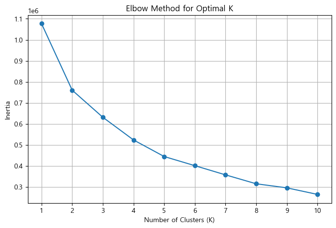
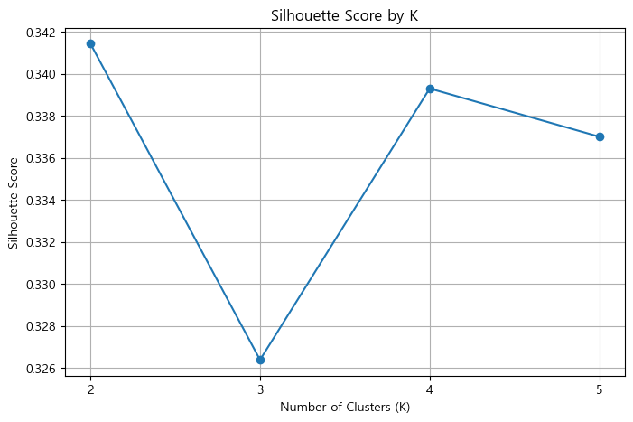

# iM-Navi · 법인 거래 패턴 기반 영업 확장 후보 탐색

> 대구·경북의 우수 거래집단을 회귀모델과 군집화로 정의하고, 코사인 유사도로 부산·경남·울산을 추가 시장조사 후보로 도출한 ML 프로젝트입니다.

**목차** · [개요](#overview) · [데이터](#data) · [변수 선정](#model) · [군집화](#clusters) · [지역 비교](#regions) · [사업 활용](#business) · [한계](#limits) · [실행](#run)

<a id="overview"></a>

## 1. 프로젝트 개요

### 어떤 문제를 해결하려 했는가?

영업권을 확장할 때는 거래 기회뿐 아니라 점포·인력 투입 비용을 함께 고려해야 합니다. 이 프로젝트는 **“기존 강점 지역인 대구·경북에서 수익 기여와 거래 관계가 두드러진 집단은 어떤 특성을 보이며, 다른 지역에도 비슷한 거래 패턴이 있는가?”**라는 질문에서 출발했습니다.

회귀모델은 예대마진과 관련된 변수를 고르는 근거로 사용하고, 군집화와 지역별 유사도 분석을 영업 후보 탐색으로 연결했습니다. 결과의 용도는 추가 조사 순서를 정하는 것이며, 신규 지점의 실제 수익이나 진출 성공확률을 예측한 것은 아닙니다.

| 항목 | 내용 |
|---|---|
| 원 프로젝트 | 대구·경북 우수 법인 고객과 가장 닮은 지역은 어디인가? |
| 수행 기간 | 2026.04.13–04.23 · 결과보고서 기준 |
| 팀 | iM-Navi · 5인 팀 프로젝트 |
| 데이터 | iM뱅크 교육용 법인 거래 데이터 · 2022.01–2024.12 |
| 접근 | Random Forest 회귀 → 중요 변수 선정 → 2단계 K-Means → 지역별 코사인 유사도 |
| 활용 제안 | 유사 지역의 시장성 조사, 기업금융 상담·거점 운영 검토 |

### 분석 흐름과 핵심 결과

**문제 정의 → 거래·금리 결합 → 회귀모델 비교 → 핵심 변수 선정 → 대경 기준집단 선정 → 타지역과 재군집화 → 유사 지역 탐색 → 사업 활용 조건 검토**

| 질문 | 확인한 결과 | 의미 |
|---|---|---|
| 어떤 변수가 예대마진과 관련되는가? | 기본 Random Forest 저장 결과 R² **0.7357**, RMSE **10.3193** | 기존 거래의 추정 예대마진을 설명하는 보조 모델 |
| 어떤 거래 특성을 중심으로 볼 것인가? | 여신한도·디지털 거래·예금좌수의 저장 중요도 합 **77.56%** | 세 변수를 군집화의 설명 축으로 선정 |
| 대경의 어떤 집단을 기준으로 삼았는가? | 1차 Cluster 2 · **70,825행** | 예대마진·여신한도 중앙값이 상대적으로 높은 기준집단 |
| 어느 지역을 우선 조사할 것인가? | 부산 **0.9900**, 경남 **0.9878**, 울산 **0.9565** | 기존 분석의 표준화 좌표에서 방향이 유사한 지역 |

수치는 팀 분석 결과입니다. **행 수는 월별 관측 수이며 고유 법인 수가 아닙니다.** 이번 로컬 검증에서는 군집 규모와 상위 3개 지역 유사도를 재확인했습니다. 기본 회귀모델의 재실행값은 R² **0.7367**, RMSE **10.3007**로 저장값과 소폭 달라 별도로 기록했습니다. 이를 성능 개선으로 해석하지 않습니다.

<a id="data"></a>

## 2. 데이터 이해와 전처리

| 구분 | 내용 | 활용 |
|---|---|---|
| 규모·기간 | 347,299행 · 45개 원변수 · 36개월 | 월별 법인 거래 관측 |
| 고객·지역 특성 | 시도, 시군구, 업종, 고객등급, 전담고객여부 | 대상 지역 선정과 집단 해석 |
| 잔액·금액 | 예금·대출 잔액, 여신한도, 디지털·오프라인·외환·카드 금액 | 추정 예대마진과 거래 특성 구성 |
| 구간형 건수 | 예금좌수, 거래건수, 상품 보유 개수 | 관계 깊이·이용 빈도의 대용 지표 |
| 보조 데이터 | 기준년월별 평균 예금·대출 금리 | 거래 관측 월에 맞는 추정 이자 계산 |

금액의 원자료 단위는 백만원입니다. 금리의 기간 기준·환산은 후속 확인이 필요하므로 추정 예대마진을 확정된 월 순이익으로 해석하지 않습니다. 데이터와 금리표는 저장소에 포함하지 않습니다.

### 전처리를 이렇게 한 이유

| 처리 | 수행 내용과 이유 |
|---|---|
| 구간형 값 수치화 | 원코드의 대표값으로 변환해 거리·모델 입력에 사용. 실제 정확한 건수로 보지 않음 |
| 파생변수 구성 | 여러 채널·상품 변수를 합쳐 거래 규모와 관계의 폭을 설명 |
| 금리 결합 | `기준년월` 기준으로 결합. 정리본은 중복 월 키와 누락 금리를 검사 |
| 지역 정제 | 타지역 비교에서 시도·시군구 결측을 제외. 초기 명세서의 결측 보정안과 구분 |
| 군집 대상 제한 | 네 핵심 변수의 결측·무한대를 제외하고 추정 예대마진 `≥ −2,500` 유지. 원코드의 고정 기준이며 최적 기준은 아님 |
| log1p·표준화 | 금액의 긴 꼬리를 압축하고 거리 계산에서 단위 차이를 완화 |

<details>
<summary><strong>추정 예대마진 산식과 실제 대상 범위</strong></summary>

```text
총예금잔액 = 요구불 + 거치식 + 적립식 예금 잔액
총대출잔액 = 운전자금 + 시설자금 대출 잔액
추정 예대마진 = 총대출잔액 × 평균대출금리(%) × 0.01
              − 총예금잔액 × 평균예금금리(%) × 0.01

전체 관측                         347,299행
대구·경북 1차 군집 대상            269,339행
그중 기준집단                       70,825행
정제한 타지역                       60,716행
기준집단 + 타지역 2차 군집 대상     131,541행
그중 지역 비교에 사용한 Cluster 2    88,926행
```

이 산식은 계약별 금리·원가·신용손실을 모두 반영한 순이익이 아닙니다. 초기 초안은 잔액 대비 수익률을 타깃으로 삼았지만, 최종 분석 경로는 **금액형 예대마진**을 사용합니다. 최종 코드에는 ‘잔액 합계가 0인 1,746행을 모두 제외’하는 처리가 활성화돼 있지 않아, 초안의 설명을 최종 처리로 옮기지 않았습니다.

군집화에서는 예대마진에 `log1p(x − 해당 집단 최소값 + 1)`, 나머지 사용 변수에 `log1p(x)`를 적용한 후 z-score로 표준화했습니다. 원코드가 대경과 타지역에 각각 변환·표준화를 적합한 점은 [해석의 한계](#limits)에 별도로 설명했습니다.

</details>

<a id="model"></a>

## 3. 회귀모델 — 군집화에 어떤 변수를 사용할 것인가?

처음부터 임의의 변수로 군집을 나누기보다, 추정 예대마진과 관련된 거래 특성을 회귀모델로 살펴봤습니다. 타깃을 직접 계산하는 예금·대출 잔액, 이자 금액 등은 입력에서 제외해 산식을 그대로 복원하는 모델이 되는 것을 피하려 했습니다. 다만 여신한도처럼 잔액과 관련되는 변수까지 포함하므로 독립적인 인과관계를 추정한 것은 아닙니다.


*원노트북에서 추출한 기본 Random Forest의 집계 중요도 그림입니다. 중요도는 해당 모델의 분할 기여이며 수익 증가의 인과효과가 아닙니다.*

| 입력 변수 | 선정 관점 |
|---|---|
| 여신한도금액 | 여신 거래 규모를 살펴보는 지표. 잔여 대출 여력인지 여부는 별도 확인 필요 |
| 총디지털거래액 | 인터넷·스마트·폰뱅킹 거래 활동 |
| 총예금좌수 | 예금 관계의 깊이를 살펴보는 대용 지표 |
| 총오프라인거래액·총카드소비·총외환실적·자동이체거래건수 | 거래 채널·결제·외환·이용 빈도의 추가 설명력 비교 |

저장된 중요도 상위 세 변수는 **여신한도 0.405512, 디지털 거래 0.195466, 예금좌수 0.174623**입니다. 합계 77.56%는 모델 중요도 내 비중으로, 예대마진의 77.56%를 이 세 변수가 인과적으로 만든다는 뜻이 아닙니다.

### 모델 비교와 결과

| 실험 | 평가 방식 | 저장 결과 |
|---|---|---|
| 기본 Random Forest · 100개 트리 | 대경 관측 무작위 80:20 분할 | Test R² 0.7357 · RMSE 10.3193 |
| Random Forest 비교 후보 | 학습 집합 내 5-fold CV | 평균 R² 0.7812 |
| XGBoost 비교 후보 | 학습 집합 내 5-fold CV | 평균 R² 0.7287 |
| LightGBM 비교 후보 | 학습 집합 내 5-fold CV | 평균 R² 0.7222 |
| Optuna RF 튜닝 | 완료된 trial 중 최대 CV R² 선택 | Best CV R² 0.780746 · Test R² 0.7353 · RMSE 10.3271 |

**튜닝이 성능을 개선했다고 결론짓지는 않았습니다.** 비교 노트북과 최종 정리 노트북의 로그 변환 범위도 다르므로 서로 다른 실험의 점수를 섞어 개선율을 계산하지 않습니다. ‘AutoML’은 원자료의 표현이며, 실제 코드는 세 모델을 반복 평가하는 수동 비교 루프입니다.

<details>
<summary><strong>검증 설계·Optuna 실행 이력·SHAP 해석</strong></summary>

- 학습 215,471행, 테스트 53,868행이며 `random_state=42`로 무작위 분할했습니다. 같은 시점의 거래로 같은 시점의 추정 마진을 설명하는 분석으로, 미래 수익 예측 성능은 아닙니다.
- 정리 노트북 기본 모델은 7개 입력 모두 log1p를 적용하고, 별도 모델 비교 노트북은 5개 금액 변수에만 적용합니다.
- 기본 모델은 로그 변환된 입력을 사용합니다. 코드에 표준화 배열 생성이 있어도 기본 모델의 `fit` 입력은 그 배열이 아닙니다.
- 비교·튜닝에서는 학습 집합 전체를 표준화한 뒤 5-fold CV에 전달합니다. 후속 실험에서는 전처리를 fold 내부 Pipeline으로 옮겨 검증 정보가 전처리에 섞이지 않게 해야 합니다. [scikit-learn 검증 지침](https://scikit-learn.org/1.9/common_pitfalls.html)
- Optuna는 30회로 설정됐지만 저장 로그에서 완료된 trial은 0–16의 **17회**입니다. trial 17에서 중단됐고, 확인된 최선 파라미터는 `n_estimators=246`, `max_depth=20`, `min_samples_split=4`, `min_samples_leaf=1`입니다. sampler seed는 고정하지 않았습니다.
- SHAP은 기본 모델의 테스트 표본 3,000행을 해석하는 진단으로 사용됐습니다. 튜닝 모델의 독립 검증이나 인과효과로 제시하지 않습니다. 관측별 점이 포함된 원 SHAP 그림은 공개본에서 제외했습니다.
- 금액형 타깃을 사용한 RMSE의 단위는 원자료와 같은 백만원입니다. 모델의 R²를 ‘73.57% 정확도’로 표현하지 않습니다.

</details>

<a id="clusters"></a>

## 4. 군집화 — 어떤 집단을 지역 비교의 기준으로 삼았는가?

### 1차: 대구·경북 내부에서 기준집단 선정

회귀 중요도 상위 세 변수에 추정 예대마진을 더한 **4개 축**으로 K-Means를 적용했습니다. 거래 관계·규모·활동과 수익 기여를 함께 해석하기 위한 구성입니다.

| 1차 군집 | 관측 수 | 예대마진 중앙값 | 예금좌수 중앙값 | 여신한도 중앙값 | 디지털 거래액 중앙값 |
|---|---:|---:|---:|---:|---:|
| Cluster 0 | 47,357 | 0.8100 | 8 | 100 | 181.7 |
| Cluster 1 | 68,332 | 1.1217 | 2 | 0 | 87.6 |
| **Cluster 2 · 기준집단** | **70,825** | **2.6184** | **4** | **290** | **157.0** |
| Cluster 3 | 82,825 | 0.4643 | 2 | 0 | 0.0 |

*금액 단위: 백만원. 좌수는 구간 대표값의 합입니다.*

Cluster 2는 예대마진과 여신한도 중앙값이 가장 높아 기준집단으로 선택했습니다. 예금좌수와 디지털 거래액은 Cluster 0가 더 높으므로 **모든 지표에서 최고인 집단**으로 설명하지 않습니다. 여기서 ‘우수’는 분석용 명칭이며 신용 건전성이나 미래 성장을 입증한 등급이 아닙니다.

<details>
<summary><strong>왜 K=4인가? — 엘보우와 실루엣을 함께 검토</strong></summary>





엘보우는 K=1–10, 실루엣은 10% 표본에서 K=2–5를 비교했습니다. **저장 결과의 실루엣 최대값은 K=2**이며, K=4는 프로파일 해석과 타지역 비교 목적을 고려한 선택입니다. ‘K=4의 실루엣이 최고 0.52’라는 발표 슬라이드의 문구는 노트북 결과와 일치하지 않아 채택하지 않았습니다.

실루엣은 군집 내 응집도와 군집 간 분리도를 살피는 지표입니다. 점포 수익이나 시장성을 검증하지는 않습니다. [scikit-learn 실루엣 예제](https://scikit-learn.org/stable/auto_examples/cluster/plot_kmeans_silhouette_analysis)

</details>

### 2차: 기준집단과 타지역을 함께 비교

대경 기준집단 70,825행과 정제한 타지역 60,716행을 결합해 **131,541행**에 K=3 군집화를 적용했습니다. 이후 대경 관측이 집중된 Cluster 2의 **88,926행**을 지역 비교 대상으로 사용했습니다. 군집 번호는 식별용 라벨이므로 다른 데이터·환경에서 같은 번호의 의미가 자동 유지되지는 않습니다.

<a id="regions"></a>

## 5. 지역 비교 — 어디를 추가 조사할 것인가?

2차 군집 안에서 대구·경북을 ‘대경’으로 묶고, 각 지역의 **표준화 변수 중앙값 벡터**를 비교했습니다. 코사인 유사도는 벡터의 방향을 비교하므로 단순 관측 수 순위와 다른 관점을 제공합니다. 실제 계산에는 군집화의 4개 축에 오프라인 거래·자동이체금액·자동이체건수·외환·카드를 더한 **9개 변수**를 사용했습니다.


| 지역 | 코사인 유사도 | 해당 비교군의 월별 관측 수 | 해석 |
|---|---:|---:|---|
| 부산광역시 | 0.9900 | 5,828 | 대경 기준집단과 방향이 가장 유사한 추가 조사 후보 |
| 경상남도 | 0.9878 | 3,301 | 유사 거래 패턴의 분포와 지역별 수요를 조사할 후보 |
| 울산광역시 | 0.9565 | 1,190 | 업종 구성·금융수요·기존 채널을 함께 확인할 후보 |

**0.99는 성공확률 99%를 의미하지 않습니다.** 현재 표본·변수·변환 기준에서 얻은 유사도입니다. 코사인은 정규화된 내적이며, 변환과 표준화의 원점이 바뀌면 값도 달라질 수 있습니다. [scikit-learn 코사인 유사도 정의](https://scikit-learn.org/stable/modules/generated/sklearn.metrics.pairwise.cosine_similarity.html)

원 분석은 제조업 구성과 정책금융·자금수요 자료를 함께 살펴 영업 기회를 해석했습니다. 다만 제공된 은행 고객 표본의 업종 비중을 지역 전체 산업 비중이나 미개척 시장 규모로 일반화하지 않았습니다. 특히 시군구 코드는 동명 지역을 합칠 수 있어 세부 지역 순위를 확정 추천으로 옮기지 않았습니다.

<a id="business"></a>

## 6. 사업 활용 — 유사도에서 실행 판단으로

### 기존 제안: 유사한 지역의 기업금융 수요 조사

부산·경남·울산을 출발점으로 업종별 자금 수요, 보증·정책금융 연계 가능성, 예금·결제 관계 확대를 검토하는 방향입니다. 유사 지역을 찾는 분석 결과와 실제 상품 수요·접촉 가능 대상은 별도로 확인해야 합니다.

### 후속 제안: 점포 확정보다 조사와 상담 단계부터 검증

| 단계 | 추가로 확인할 정보 | 다음 결정 |
|---|---|---|
| 1. 시장성 조사 | 지역 전체 기업 수·업종, 기존 지점·경쟁은행, 표본의 지역 편향 | 조사 우선순위를 유지할지 판단 |
| 2. 실제 대상 확인 | 내부 비식별 ID, 중복 제거, 기존 거래 관계·접촉 가능 여부 | 실제 상담 후보 구성 |
| 3. 소규모 영업 검증 | 방문·상담 비용, 상담→거래 전환, 위험조정 기여 | 담당자 배치·출장 상담 등 운영 방식 비교 |
| 4. 거점 투자 검토 | 임차·인력·운영비, 잠식 효과, 유지율, 신용손실 | 확대·수정·중단 결정 |

이 단계는 **포트폴리오 정리 과정에서 제안한 후속 실행안**으로, 원 프로젝트에서 실행한 영업 실적이 아닙니다. 제공 자료에 원가·전환율·거점 운영 성과가 없어 확정 이익이나 ROI를 제시하지 않습니다.

<details>
<summary><strong>기업 관점에서 무엇을 수익성 지표로 연결할 것인가?</strong></summary>

```text
기대 순증 기여
  = 접촉 가능 고유 법인 수
    × 기존 방식 대비 추가 거래 전환율
    × 거래 법인당 위험·원가 조정 후 기여
    − 추가 조사·상담·거점 운영비
```

각 항목의 측정 기간을 동일하게 맞추고, 기존 거래에서 발생하던 기여를 신규 성과에 중복 포함하지 않아야 합니다. 현재 월별 관측 수를 첫 항목에 그대로 대입할 수 없으며, 코사인 유사도를 전환율로 사용할 수도 없습니다.

파일럿은 유사도 점수 자체가 아니라 **접촉당 증분 기여, 신규 거래 전환, 관계 유지, 신용손실과 운영비**로 평가하는 방향을 제안합니다. 비교군이나 단계적 도입 설계로 기존 영업 대비 추가 효과를 확인해야 합니다.

</details>

<a id="limits"></a>

## 7. 해석의 한계와 개선 방향

- **표본과 법인 ID:** 특정 은행의 월별 관측이며 지역 전체 시장을 대표하지 않습니다. 월별로 연결할 고유 법인 ID가 없어 고객 중복·개별 이동·장기 수익 지속성을 확인하지 못했습니다.
- **시간·고객 단위 검증:** 무작위 분할은 미래 시점이나 새로운 지역으로의 일반화를 검증하지 않습니다. 비식별 ID 확보 후 고객 단위 분할과 기간 외·지역 외 검증이 필요합니다.
- **지역별 변환 기준:** 대경과 타지역을 각각 로그 이동·표준화한 값을 합쳤습니다. 서로 다른 기준에서의 상대 위치를 비교하므로 동일한 절대 거래 특성이라고 해석하기 어렵습니다. 후속 분석은 공통 기준으로 적합한 변환을 적용하고 순위 민감도를 비교해야 합니다.
- **지리적 결합 키:** 원코드는 시군구 이름만 묶고 첫 시도를 붙입니다. 동명 구가 섞일 수 있어 `시도 + 시군구` 복합 키로 재검증하기 전에는 세부 입지를 확정하지 않습니다.
- **추정 수익·변수 정의:** 평균 금리를 사용한 예대마진은 실제 순이익이 아닙니다. 금리 환산, 여신한도 정의, 구간 대표값의 영향은 추가 확인 대상입니다.
- **변수·군집 선택:** 중요도 상위 변수와 특정 군집을 선택한 뒤 유사도를 계산했으므로 선택에 따른 영향이 있습니다. K, seed, 변수 조합·가중치와 기간을 바꾼 안정성 검증이 필요합니다.
- **성과의 범위:** 군집 재현과 높은 유사도는 거점 투자 효과의 검증이 아닙니다. 사업 성과는 별도 영업 실험과 원가·위험 자료로 평가해야 합니다.

이번 정리에서는 기존 계산 기준을 보존하고 확인된 문제를 구분했습니다. 수정된 새로운 지역 순위를 원래 프로젝트 결과처럼 제시하지 않았습니다. 출처 충돌과 변경 범위는 [분석 근거와 재검토 사항](../docs/results-evidence.md)에 정리했습니다.

<a id="run"></a>

## 8. 사용 기술과 실행 방법

| 구분 | 기술 |
|---|---|
| 데이터 처리 | Python · pandas · NumPy |
| 핵심 모델·검증 | scikit-learn · Random Forest · K-Means · 코사인 유사도 |
| 원 실험의 비교·튜닝 | XGBoost · LightGBM · Optuna |
| 해석·시각화 | Feature Importance · SHAP · Matplotlib · seaborn |
| 문서 | Jupyter Notebook · Markdown |

```text
README.md                     # 프로젝트 흐름과 결과·판단
portfolio-summary.md          # 웹 포트폴리오용 요약
notebooks/01-analysis.ipynb    # 공개 집계 결과와 그림 열람
src/pipeline.py               # 전처리·기본 회귀·기존 군집/유사도 계산
src/model_selection.py        # 선택 실행용 모델 비교·Optuna 실험
scripts/                      # 로컬 실행·집계 그림·공개본 검사
docs/                         # 입력 형식·분석 근거·실행 범위
assets/                       # 집계 JSON과 공개용 그래프
requirements.txt              # 실제 핵심 재실행 환경의 패키지 버전
requirements-optional.txt     # 이번에 재실행하지 않은 비교·튜닝 의존성
```

데이터 없이 README·그래프·공개 노트북을 읽을 수 있습니다. 노트북 기본 셀은 집계 JSON과 이미지 파일만 읽으며 모델을 자동 학습하지 않습니다.

```powershell
python scripts/validate_repository.py
```

검사 명령은 표준 라이브러리만 사용합니다. 승인된 실데이터로 실행하려면 [실행 안내](../docs/reproduction.md)의 두 CSV 경로를 전달하세요. **원자료·개별 거래행·원문 발표자료·모델 파일은 공개본에 포함하지 않습니다.**

로컬에서는 전처리, 기본 회귀, 2단계 군집화, 시도 유사도를 실제 실행했습니다. 모델 비교의 전체 CV·Optuna 재탐색·SHAP·전체 실루엣 재계산은 이번에 수행하지 않았습니다. 이 항목은 저장 결과의 확인과 코드 검토 범위로 구분합니다.
